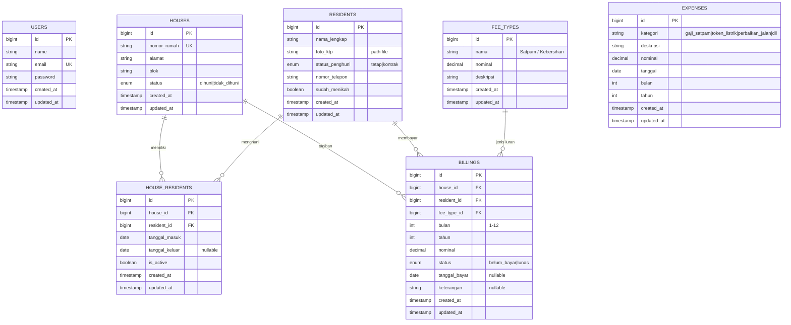

# Aplikasi Administrasi RT – Iuran Warga Perumahan

Aplikasi fullstack untuk mengelola administrasi iuran bulanan perumahan elite. Dibangun dengan **Laravel** (Backend API), **React** (Frontend SPA), dan **MySQL** (Database).

---

## User Review Required

> [!IMPORTANT]
> **Tech Stack yang digunakan sesuai ketentuan:**
> - Backend: **Laravel 11** (PHP 8.2+)
> - Frontend: **React 18** (Vite + React Router)
> - Database: **MySQL 8.0**
> - Tanpa Docker

> [!WARNING]
> **Asumsi yang diambil:**
> - Aplikasi ini single-user (hanya RT yang mengakses), sehingga autentikasi sederhana (login satu user admin).
> - Upload foto KTP menggunakan local storage Laravel (`storage/app/public`).
> - Iuran default: Satpam Rp 100.000/bulan, Kebersihan Rp 15.000/bulan – dibuat konfigurabel di database.
> - Periode billing dimulai dari bulan aktif penghuni menempati rumah.

---

## Open Questions

> [!IMPORTANT]
> 1. **Autentikasi**: Apakah cukup login sederhana (1 admin RT saja), atau perlu multi-user (misal: sekretaris, bendahara)?
> 2. **Notifikasi**: Apakah perlu notifikasi WhatsApp/SMS untuk tagihan warga, atau cukup manual?
> 3. **Cetak Laporan**: Apakah report perlu bisa di-export ke PDF/Excel?
> 4. **Hosting**: Akan di-deploy ke server atau cukup dijalankan lokal?

---

## ERD (Entity Relationship Diagram)



### Penjelasan Relasi

| Relasi | Deskripsi |
|--------|-----------|
| `HOUSES ↔ RESIDENTS` | Many-to-Many melalui tabel pivot `HOUSE_RESIDENTS` dengan historical tracking |
| `HOUSES → BILLINGS` | Satu rumah memiliki banyak tagihan |
| `RESIDENTS → BILLINGS` | Satu penghuni memiliki banyak tagihan |
| `FEE_TYPES → BILLINGS` | Jenis iuran terkait dengan tagihan |
| `EXPENSES` | Standalone – pengeluaran RT (gaji satpam, token listrik, perbaikan, dll) |

---

## Proposed Changes

### 1. Backend – Laravel API

Struktur folder: `d:\Ali\Project\beon-test\backend\`

#### [NEW] Laravel Project Setup

```
backend/
├── app/
│   ├── Http/
│   │   ├── Controllers/
│   │   │   ├── AuthController.php
│   │   │   ├── ResidentController.php
│   │   │   ├── HouseController.php
│   │   │   ├── BillingController.php
│   │   │   ├── ExpenseController.php
│   │   │   ├── ReportController.php
│   │   │   └── FeeTypeController.php
│   │   ├── Requests/
│   │   │   ├── ResidentRequest.php
│   │   │   ├── HouseRequest.php
│   │   │   ├── BillingRequest.php
│   │   │   └── ExpenseRequest.php
│   │   └── Resources/
│   │       ├── ResidentResource.php
│   │       ├── HouseResource.php
│   │       ├── BillingResource.php
│   │       └── ExpenseResource.php
│   └── Models/
│       ├── User.php
│       ├── Resident.php
│       ├── House.php
│       ├── HouseResident.php
│       ├── FeeType.php
│       ├── Billing.php
│       └── Expense.php
├── database/
│   ├── migrations/
│   │   ├── create_residents_table.php
│   │   ├── create_houses_table.php
│   │   ├── create_house_residents_table.php
│   │   ├── create_fee_types_table.php
│   │   ├── create_billings_table.php
│   │   └── create_expenses_table.php
│   └── seeders/
│       ├── FeeTypeSeeder.php
│       ├── HouseSeeder.php
│       └── DatabaseSeeder.php
└── routes/
    └── api.php
```

#### API Endpoints

| Method | Endpoint | Deskripsi |
|--------|----------|-----------|
| **Auth** | | |
| `POST` | `/api/login` | Login admin |
| `POST` | `/api/logout` | Logout |
| **Penghuni** | | |
| `GET` | `/api/residents` | List semua penghuni |
| `POST` | `/api/residents` | Tambah penghuni (+ upload KTP) |
| `GET` | `/api/residents/{id}` | Detail penghuni |
| `PUT` | `/api/residents/{id}` | Update penghuni |
| **Rumah** | | |
| `GET` | `/api/houses` | List semua rumah |
| `POST` | `/api/houses` | Tambah rumah |
| `GET` | `/api/houses/{id}` | Detail rumah + history penghuni + history pembayaran |
| `PUT` | `/api/houses/{id}` | Update rumah |
| `POST` | `/api/houses/{id}/assign-resident` | Assign penghuni ke rumah |
| `POST` | `/api/houses/{id}/remove-resident` | Remove penghuni dari rumah (set tanggal_keluar) |
| **Pembayaran** | | |
| `GET` | `/api/billings` | List tagihan (filter: bulan, tahun, status, rumah) |
| `POST` | `/api/billings` | Buat tagihan manual |
| `PUT` | `/api/billings/{id}` | Update status bayar (tandai lunas) |
| `POST` | `/api/billings/generate` | Generate tagihan bulanan otomatis untuk semua rumah dihuni |
| `POST` | `/api/billings/bulk-pay` | Bayar iuran multi-bulan (misal 1 tahun sekaligus) |
| **Pengeluaran** | | |
| `GET` | `/api/expenses` | List pengeluaran (filter: bulan, tahun) |
| `POST` | `/api/expenses` | Tambah pengeluaran |
| `PUT` | `/api/expenses/{id}` | Update pengeluaran |
| `DELETE` | `/api/expenses/{id}` | Hapus pengeluaran |
| **Jenis Iuran** | | |
| `GET` | `/api/fee-types` | List jenis iuran + nominal |
| `PUT` | `/api/fee-types/{id}` | Update nominal iuran |
| **Report** | | |
| `GET` | `/api/reports/summary?year=2026` | Summary pemasukan, pengeluaran, saldo per bulan (1 tahun) |
| `GET` | `/api/reports/monthly?month=6&year=2026` | Detail pemasukan & pengeluaran bulan tertentu |

#### Fitur Backend Utama

1. **Upload Foto KTP** – Menggunakan `storage/app/public`, symlink ke `public/storage`
2. **Generate Tagihan** – Auto-generate tagihan untuk semua rumah yang dihuni pada awal bulan
3. **Bulk Payment** – Penghuni bisa bayar iuran kebersihan 1 tahun sekaligus
4. **History Tracking** – `house_residents` mencatat siapa menghuni kapan, dengan `is_active` flag
5. **Sanctum Auth** – Laravel Sanctum untuk API token authentication

---

### 2. Frontend – React SPA

Struktur folder: `d:\Ali\Project\beon-test\frontend\`

#### [NEW] React Project Setup (Vite)

```
frontend/
├── src/
│   ├── api/
│   │   └── axios.js              # Axios instance + interceptors
│   ├── components/
│   │   ├── layout/
│   │   │   ├── Sidebar.jsx
│   │   │   ├── Header.jsx
│   │   │   └── MainLayout.jsx
│   │   ├── ui/
│   │   │   ├── Button.jsx
│   │   │   ├── Modal.jsx
│   │   │   ├── Table.jsx
│   │   │   ├── Card.jsx
│   │   │   ├── StatusBadge.jsx
│   │   │   └── LoadingSpinner.jsx
│   │   ├── residents/
│   │   │   ├── ResidentForm.jsx
│   │   │   └── ResidentCard.jsx
│   │   ├── houses/
│   │   │   ├── HouseForm.jsx
│   │   │   ├── HouseCard.jsx
│   │   │   └── ResidentHistory.jsx
│   │   ├── billings/
│   │   │   ├── BillingForm.jsx
│   │   │   ├── BillingTable.jsx
│   │   │   └── BulkPaymentModal.jsx
│   │   ├── expenses/
│   │   │   ├── ExpenseForm.jsx
│   │   │   └── ExpenseTable.jsx
│   │   └── reports/
│   │       ├── SummaryChart.jsx      # Chart.js / Recharts
│   │       └── MonthlyDetail.jsx
│   ├── pages/
│   │   ├── LoginPage.jsx
│   │   ├── DashboardPage.jsx
│   │   ├── ResidentsPage.jsx
│   │   ├── HousesPage.jsx
│   │   ├── HouseDetailPage.jsx
│   │   ├── BillingsPage.jsx
│   │   ├── ExpensesPage.jsx
│   │   └── ReportsPage.jsx
│   ├── hooks/
│   │   ├── useAuth.js
│   │   └── useFetch.js
│   ├── context/
│   │   └── AuthContext.jsx
│   ├── App.jsx
│   ├── main.jsx
│   └── index.css
├── package.json
└── vite.config.js
```

#### Halaman & Fitur Frontend

| Halaman | Fitur |
|---------|-------|
| **Login** | Form login admin |
| **Dashboard** | Overview: jumlah rumah, penghuni, tagihan belum lunas, grafik ringkas |
| **Penghuni** | CRUD penghuni, upload foto KTP, filter by status |
| **Rumah** | List rumah + status (dihuni/kosong), assign/remove penghuni |
| **Detail Rumah** | History penghuni, history pembayaran per rumah |
| **Pembayaran** | Tabel tagihan + filter (bulan, tahun, status), tandai lunas, bulk payment |
| **Pengeluaran** | CRUD pengeluaran, filter per bulan/tahun |
| **Laporan** | Grafik pemasukan vs pengeluaran 1 tahun, detail per bulan, saldo |

#### Library Frontend

| Library | Kegunaan |
|---------|----------|
| `react-router-dom` | Routing SPA |
| `axios` | HTTP client |
| `recharts` | Grafik/chart untuk reporting |
| `react-hot-toast` | Notifikasi toast |
| `react-icons` | Icon set |
| `dayjs` | Date formatting |

#### UI Design Approach

- **Dark mode** dengan aksen warna modern (deep navy + teal/emerald gradients)
- **Glassmorphism** cards untuk dashboard overview
- **Smooth animations** pada transisi halaman dan modal
- **Responsive** – mobile-friendly untuk akses dari HP RT
- **Google Fonts** – Inter untuk body, Outfit untuk heading

---

### 3. Database – MySQL

#### [NEW] Seeders

| Seeder | Data |
|--------|------|
| `FeeTypeSeeder` | 2 record: Iuran Satpam (Rp 100.000), Iuran Kebersihan (Rp 15.000) |
| `HouseSeeder` | 20 rumah (Blok A1–A20) |

---

## Tahapan Pengerjaan

### Phase 1: Foundation (Backend)
1. Init project Laravel
2. Setup database, migrations, dan seeders
3. Implementasi Models + Relationships
4. Implementasi Auth (Sanctum)
5. API Resources & Form Requests

### Phase 2: Core API Endpoints
1. CRUD Residents (+ upload foto KTP)
2. CRUD Houses + Assign/Remove Resident
3. Billing management (generate, pay, bulk-pay)
4. Expense management
5. Fee Types management

### Phase 3: Reporting API
1. Endpoint summary tahunan (pemasukan, pengeluaran, saldo)
2. Endpoint detail bulanan

### Phase 4: Frontend Foundation
1. Init project React (Vite)
2. Setup routing, layout, design system (CSS)
3. Auth context + Login page

### Phase 5: Frontend Pages
1. Dashboard page
2. Residents page (CRUD + upload KTP)
3. Houses page (+ detail + history)
4. Billings page (+ bulk payment)
5. Expenses page

### Phase 6: Reporting & Polish
1. Report page dengan grafik (Recharts)
2. Polish UI, animasi, responsive
3. Error handling & loading states

### Phase 7: Documentation
1. ERD final (gambar/diagram)
2. Panduan Instalasi lengkap (README.md)
3. Screenshot per fitur

---

## Verification Plan

### Automated Tests
```bash
# Backend
cd backend
php artisan test

# Frontend
cd frontend
npm run build   # memastikan tidak ada error build
```

### Manual Verification
- [ ] Login/logout berfungsi
- [ ] CRUD penghuni (tambah, edit, upload KTP)
- [ ] CRUD rumah (tambah, edit, assign/remove penghuni)
- [ ] History penghuni per rumah tampil benar
- [ ] Generate tagihan bulanan untuk semua rumah dihuni
- [ ] Tandai lunas satu tagihan
- [ ] Bulk payment iuran kebersihan 1 tahun
- [ ] History pembayaran per rumah + status lunas/belum
- [ ] CRUD pengeluaran
- [ ] Grafik pemasukan vs pengeluaran 1 tahun
- [ ] Detail pemasukan & pengeluaran per bulan
- [ ] Saldo tersisa tampil benar
- [ ] Responsive di mobile
- [ ] Panduan instalasi bisa diikuti dari awal hingga running

---

## Output Deliverables

| Output | Format |
|--------|--------|
| **ERD** | Mermaid diagram + gambar PNG |
| **Backend Repo** | `d:\Ali\Project\beon-test\backend\` (Laravel) |
| **Frontend Repo** | `d:\Ali\Project\beon-test\frontend\` (React) |
| **Panduan Instalasi** | `README.md` di root project |
| **Screenshot** | Per fitur, disertakan di dokumentasi |
